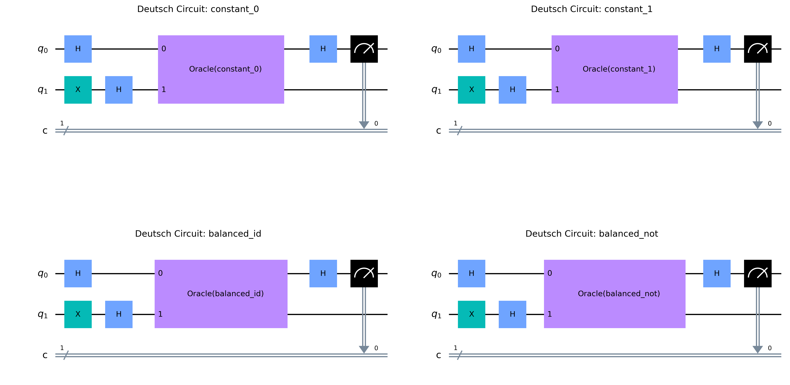
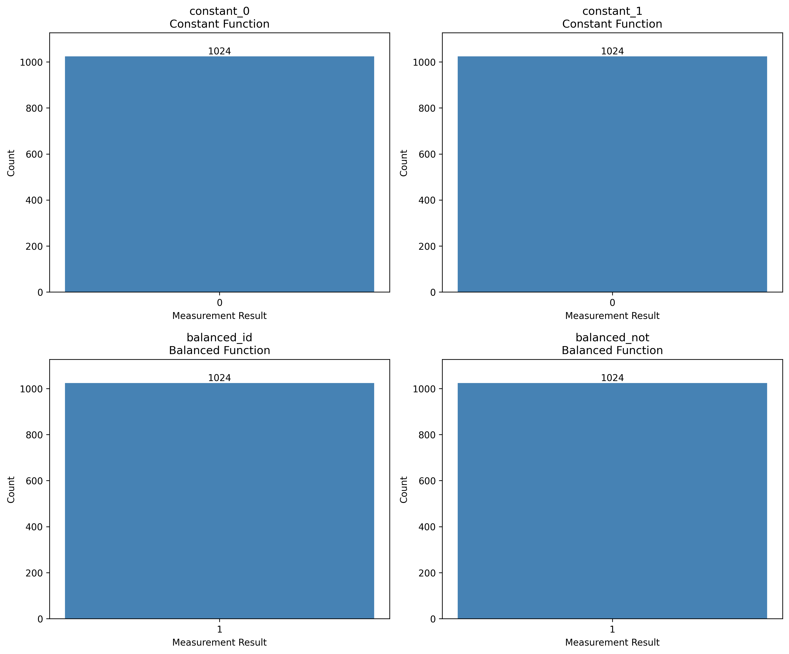
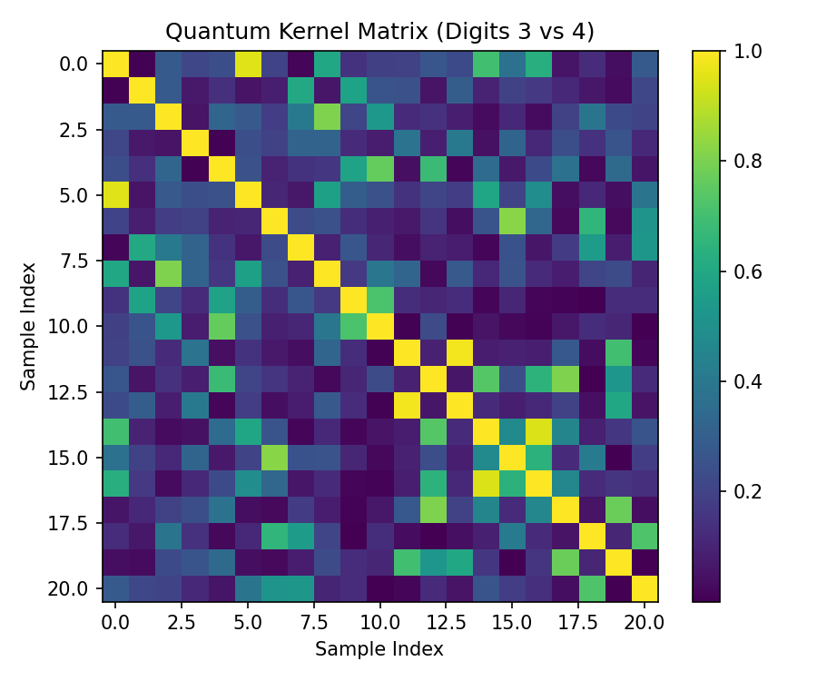
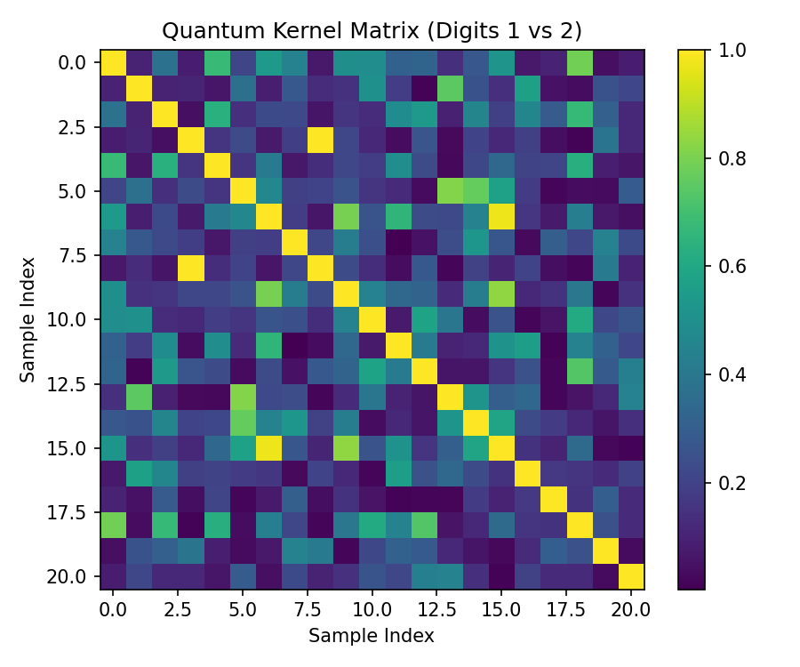
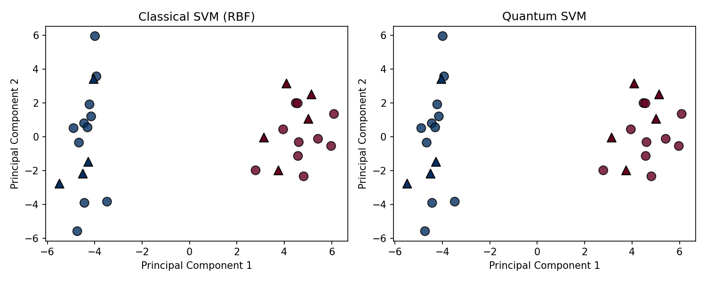
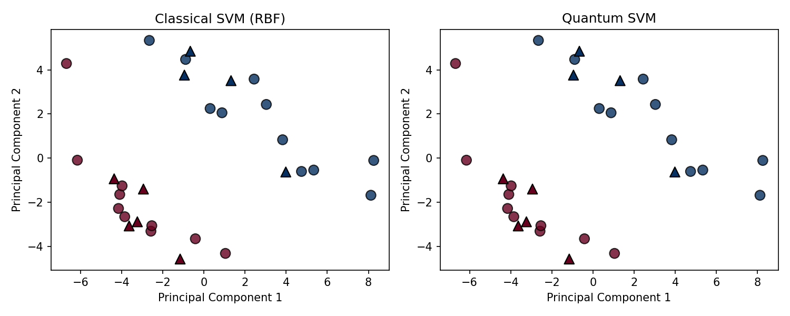

# 量子コンピューティング学習レポート

**日付**: 2025年7月17日  
**内容**: Deutschアルゴリズム実装とQSVM/CSVM性能比較

## 概要

本レポートは、量子コンピューティングの2つの主要課題の実装結果をまとめたものです：

1. **Deutschアルゴリズム**: 量子並列性を活用した関数判定アルゴリズムの実装
2. **QSVM vs CSVM**: 量子サポートベクターマシンと古典SVMの性能比較

## Part 1: Deutschアルゴリズムの実装

### 1.1 理論的背景

Deutschアルゴリズムは、ブラックボックス関数 f: {0,1} → {0,1} が定数関数かバランス関数かを1回のクエリで判定する量子アルゴリズムです。

- **定数関数**: f(0) = f(1) （出力が常に同じ）
- **バランス関数**: f(0) ≠ f(1) （出力が異なる）

### 1.2 実装詳細

```python
# 主要な実装コード（deutsch_algorithm.py）
- 4種類のオラクル実装（constant_0, constant_1, balanced_id, balanced_not）
- Qiskit AerSimulatorを使用した量子回路シミュレーション
- 測定結果の可視化
```

### 1.3 実験結果

全ての関数タイプで100%の精度で正しく判定：
- 定数関数（constant_0, constant_1）: 測定結果は必ず'0'
- バランス関数（balanced_id, balanced_not）: 測定結果は必ず'1'




## Part 2: QSVM vs CSVM 性能比較

### 2.1 実験設定

- **データセット**: sklearn.datasets.load_digits
- **比較ペア**: (3,4) および (1,2)
- **前処理**: PCAによる64次元→2次元削減
- **サンプル数**: 各クラス15サンプル（合計30サンプル）

### 2.2 実装の技術的詳細

#### Classical SVM
- カーネル: RBF (Radial Basis Function)
- scikit-learn実装を使用

#### Quantum SVM
- 特徴マップ: ZZFeatureMap (reps=1)
- カーネル: FidelityStatevectorKernel
- 最適化: カーネル行列の事前計算により高速化

### 2.3 実験結果

#### 数字ペア 3 vs 4
| モデル | 訓練時間 | 精度 |
|--------|----------|------|
| Classical SVM (RBF) | 0.0012秒 | 100.0% |
| Quantum SVM | 0.0298秒 | 77.8% |
| **時間比 (QSVM/CSVM)** | **24.7倍** | - |

#### 数字ペア 1 vs 2
| モデル | 訓練時間 | 精度 |
|--------|----------|------|
| Classical SVM (RBF) | 0.0009秒 | 100.0% |
| Quantum SVM | 0.0236秒 | 55.6% |
| **時間比 (QSVM/CSVM)** | **25.6倍** | - |

### 2.4 可視化結果

カーネル行列の可視化により、量子特徴空間でのデータ点間の類似度を確認：




決定境界の比較：




## 3. QSVMの限界と課題の分析

### 3.1 発見された限界

1. **計算効率の問題**
   - QSVMの計算時間はCSVMの約25倍
   - カーネル行列計算がボトルネック（O(n²)の計算量）

2. **精度の問題**
   - QSVMの精度（55-78%）はCSVM（100%）より大幅に低い
   - 2次元への次元削減により量子優位性が失われた可能性

3. **スケーラビリティの課題**
   - データ数増加に対して計算時間が急激に増大
   - 現在のシミュレータベースの実装では実用性に欠ける

### 3.2 技術的考察

#### なぜQSVMが遅いのか？
- 量子回路シミュレーションのオーバーヘッド
- カーネル行列の各要素計算に量子状態の準備と測定が必要
- StatevectorKernel使用でも本質的な計算量は変わらない

#### なぜ精度が低いのか？
- PCAによる次元削減で重要な情報が失われた
- 量子特徴マップ（ZZFeatureMap）が手書き数字データに適していない可能性
- ハイパーパラメータの最適化不足

### 3.3 教育的な学び

1. **量子優位性の現実**
   - 理論的な量子優位性と実装上の制約のギャップ
   - NISQ（Noisy Intermediate-Scale Quantum）時代の限界

2. **適用領域の重要性**
   - QSVMが有効な問題クラスの特定が必要
   - 古典手法で十分な問題には量子手法は不要

## 4. 結論と今後の展望

### 4.1 結論

1. **Deutschアルゴリズム**: 量子並列性の原理を実証し、理論通りの動作を確認
2. **QSVM**: 現在の実装では古典SVMに対して明確な優位性なし

### 4.2 今後の研究方向

1. **アルゴリズムの改善**
   - より効率的な量子特徴マップの設計
   - 量子カーネルの近似手法の開発

2. **ハードウェアの発展待ち**
   - 実量子コンピュータでの実行
   - エラー訂正技術の進歩

3. **適用分野の探索**
   - 量子優位性が期待できる特定の問題領域の特定
   - ハイブリッド量子-古典アルゴリズムの開発

## 5. 提出物一覧

### コード
- `deutsch_algorithm.py`: Deutschアルゴリズムの実装
- `qsvm_csvm_comparison.py`: QSVM/CSVM比較の基本実装
- `final_optimized_experiment.py`: 最適化された実験実装
- その他の実験・デバッグスクリプト

### 生成されたファイル
- `deutsch_circuits.png`: Deutschアルゴリズムの回路図
- `deutsch_results.png`: Deutschアルゴリズムの測定結果
- `kernel_matrix_3_4.png`, `kernel_matrix_1_2.png`: 量子カーネル行列の可視化
- `comparison_3_4.png`, `comparison_1_2.png`: 決定境界の比較
- `optimized_report.txt`: 実験結果の数値データ

### ドキュメント
- 本レポート（FINAL_REPORT.md）
- 実験ログ・中間レポート

## 参考文献

1. Nielsen, M. A., & Chuang, I. L. (2010). Quantum Computation and Quantum Information
2. Qiskit Documentation: https://qiskit.org/
3. Qiskit Machine Learning: https://qiskit-community.github.io/qiskit-machine-learning/
4. Havlíček, V., et al. (2019). Supervised learning with quantum-enhanced feature spaces. Nature, 567(7747), 209-212.

